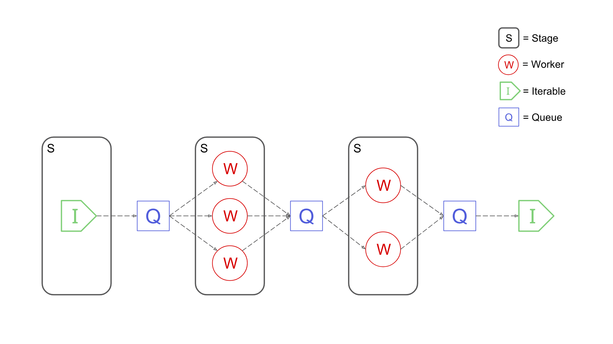

# Pypeline

_Pypeline is a python library that enables you to easily create concurrent/parallel data pipelines._

* Pypeline was designed to solve simple _medium_ data tasks that require concurrency and parallelism but where using frameworks like Spark or Dask feel exaggerated or unnatural.
* Pypeline hides away all the boilerplate code required to execute concurrent/parallel tasks and exposes an easy to use, familiar, functional API.
* Pypeline enables you to build concurrent pipelines using all 3 major concurrency/parallelism mechanisms in Python (multiprocessing, threading, and asyncio) via the exact same API.
* Pypeline allows you to have control over the memory and cpu resources used at each stage of your pipeline.

## Instalation

To install Pypeline with pip run
```bash
pip install pypeln
```
If you want the latest development version you can install via
```bash
pip install git+https://github.com/cgarciae/pypeln@develop
```

## Concept
**<<MAYBE MOVE THIS TO THE GUIDE???>>**

When creating a program that performs several non-trivial operations other sequences in an efficient manner it common to end up doing the following:

* Breaking the problem into several concurrent **stages**
* Creating several **worker** entities at each stage to complete the task in parallel (if possible)

Given this you can end up having architectures such as this one



On each stage workers _get_ the data from a **queue** structure from a previous stage, perform certain operations over it, and _put_ the result into the next queue for another stage to consume. As shown in the diagram, the initial stage consumes the _iterable_ source, and a final iterable sink is created to receive the results. 

## Basic Usage
With Pypeline you can create multi-stage data pipelines using familiar functions like `map`, `flat_map`, `filter`, etc. While doing so you will define a computational graph that specifies the operations to be performed at each stage, the amount of resources, and the type of workers you want to use. Pypeline comes with 3 main modules, each uses a different type of worker:

### Processes
You can create a pipeline based on [multiprocessing.Process](https://docs.python.org/3.4/library/multiprocessing.html#multiprocessing.Process) workers by using the `pr` module:

```python
from pypeln import pr
import time
from random import random

def slow_add1(x):
    time.sleep(random()) # <= some slow computation
    return x + 1

def slow_gt3(x):
    time.sleep(random()) # <= some slow computation
    return x > 3

data = range(10) # [0, 1, 2, ..., 9] 

stage = pr.map(slow_add1, data, workers = 3, maxsize = 4)
stage = pr.filter(slow_gt3, stage, workers = 2)

data = list(stage) # e.g. [5, 6, 9, 4, 8, 10, 7]
```
Here the following is happening:
* A 3 staged pipeline is created (the `data` iterable is implicitly converted into an input stage with 1 worker)
* A total of 6 Process workers (1 + 3 + 2) will be created
* The `maxsize` parameter limits the amount of elements that the input `Queue` of a stage can hold.

### Threads
You can create a pipeline based on [threading.Thread](https://docs.python.org/3/library/threading.html#threading.Thread) workers by using the `th` module:
```python
from pypeln import th
import time
from random import random

def slow_add1(x):
    time.sleep(random()) # <= some slow computation
    return x + 1

def slow_gt3(x):
    time.sleep(random()) # <= some slow computation
    return x > 3

data = range(10) # [0, 1, 2, ..., 9] 

stage = th.map(slow_add1, data, workers = 3, maxsize = 4)
stage = th.filter(slow_gt3, stage, workers = 2)

data = list(stage) # e.g. [5, 6, 9, 4, 8, 10, 7]
```
Here we have the exact same situation as in the previous case except that the worker are Threads.

### Tasks
You can create a pipeline based on [asyncio.Task](https://docs.python.org/3.4/library/asyncio-task.html#asyncio.Task) workers by using the `io` module:
```python
from pypeln import io
import asyncio
from random import random

async def slow_add1(x):
    await asyncio.sleep(random()) # <= some slow computation
    return x + 1

async def slow_gt3(x):
    await asyncio.sleep(random()) # <= some slow computation
    return x > 3

data = range(10) # [0, 1, 2, ..., 9] 

stage = io.map(slow_add1, data, workers = 3, maxsize = 4)
stage = io.filter(slow_gt3, stage, workers = 2)

data = list(stage) # e.g. [5, 6, 9, 4, 8, 10, 7]
```
While conceptually similar there are a few differences to the previous 2 cases due to the nature of asyncio:
* Everything is running in a single thread, as everything in asyncio.
* Due to the light-weight nature of asyncio Tasks, workers are created dynamically. On each stage the total amount of workers existing simultaneously is specified by the `workers` parameter, you can remove this bound by setting `workers = 0`.


## Benchmarks
**[COMMING SOON]**

## Resources

* [Pypeline API Documentation](https://cgarciae.github.io/pypeln/) **[WORK IN PROGRESS]**
* Pypeline Guide: **[COMMING SOON]**

## Related Material
* 


## Contributors
* [cgarciae](https://github.com/cgarciae)
* [davidnet](https://github.com/davidnet)